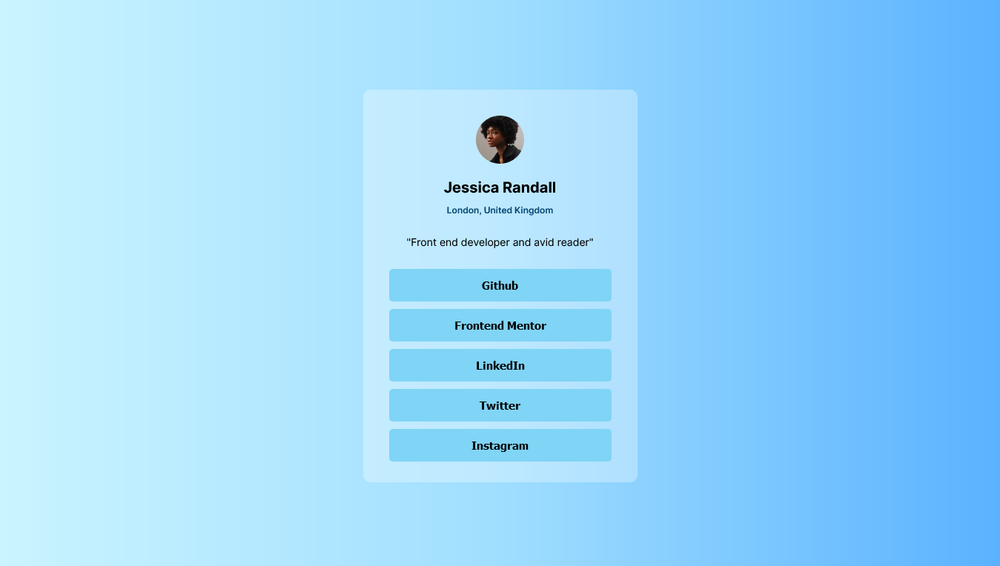
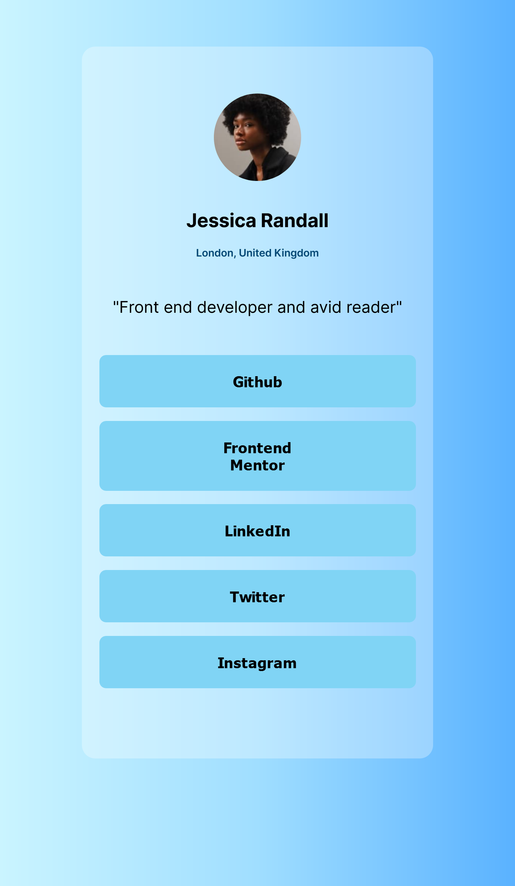

# Social-Links

## Overview

### The challenge

Users should be able to:

- See hover and focus states for all interactive elements on the page

### Screenshot

### Links

- Solution URL: [https://github.com/RachelAbit/Social-Links](https://your-solution-url.com)
- Live Site URL: [Add live site URL here](https://your-live-site-url.com)

## My process

I started putting together an HTML document's structure. Second, I create CSS styling; I can easily apply fonts, background colors etc. because I know the CSS fundamentals. Then I added the CSS function min(), and honestly, I had trouble in that area.

### Built with

- Semantic HTML5 markup
- Flexbox
- No Frameworks

### What I learned

When I created this project, I learned how to use CSS min(). Actually, min() and other CSS functions such as max(), clamp(), and calc() are very useful to change the sizes of elements without using media queries. 

### Continued development

as for my future projects, I want to learn more about:

- CSS function

- CSS Pseudo-elements

- CSS Animation

## Author

- Frontend Mentor - [@RachelAbit](https://www.frontendmentor.io/profile/RachelAbit)
